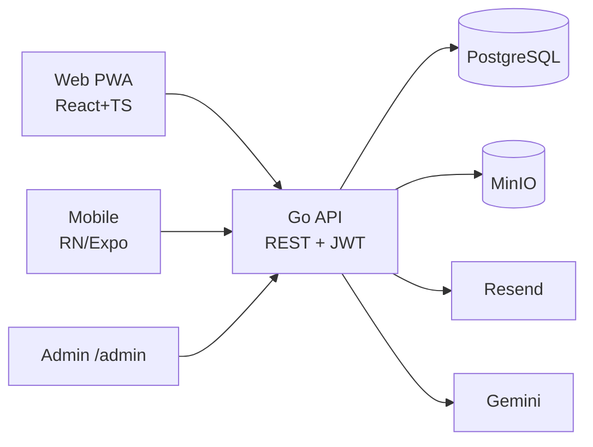

# 🌿 Canopy

> Nền tảng dùng AI để **nhận diện cây**, **chẩn đoán bệnh**, sinh **lộ trình chữa
> trị**, **quản lý vườn cây + nhắc lịch chăm sóc**, và kết nối **cộng đồng**
> (người chơi · người bán · người chăm sóc). Web PWA trước, React Native sau —
> dùng chung backend + API.

<p align="center">
  <em>Go API · PostgreSQL · MinIO · Resend · Gemini · React PWA · React Native (Expo)</em>
</p>

---

## ✨ Trụ cột

1. **Nhận diện cây** — chụp ảnh → loài + hồ sơ chăm sóc (AI).
2. **Chẩn đoán bệnh** — ảnh lá + triệu chứng → bệnh, mức độ, nguyên nhân.
3. **Lộ trình chữa trị** — kế hoạch theo ngày, theo dõi tiến độ.
4. **Quản lý vườn** — danh sách cây, hồ sơ, lịch sử.
5. **Nhắc lịch chăm sóc** — tưới/bón/cắt tỉa → reminder + notification.
6. **Cộng đồng & marketplace** — bán cây / dịch vụ chăm, chat, review.
7. **Admin portal** — cấu hình API key / AI provider. **App không chạy cho tới
   khi cấu hình đủ** (readiness gate).

## 🧱 Kiến trúc



Điểm mấu chốt giúp **RN-ready**: `packages/shared` (TS types + API client,
không phụ thuộc API trình duyệt) được web **và** mobile dùng chung. Xem
[`docs/ARCHITECTURE.md`](docs/ARCHITECTURE.md).

## 📁 Cấu trúc monorepo

```
canopy/
├── apps/
│   ├── api/        # Go backend (Gin, pgx/sqlc, golang-migrate, slog)
│   ├── web/        # React PWA (Vite, Tailwind, TanStack Query, Zustand)
│   ├── admin/      # Admin portal (Phase 1: route /admin trong web)
│   └── mobile/     # React Native / Expo (Phase 8)
├── packages/
│   └── shared/     # TS types + CanopyClient dùng chung web & mobile
├── docs/           # SPEC · ARCHITECTURE · DESIGN_SYSTEM · ROADMAP
├── docker-compose.yml
├── Makefile
└── .env.example
```

## 🚀 Quickstart (Phase 0)

Yêu cầu: **Docker**, **Go 1.25+**, **Node 20+**, **pnpm 10+**.

```bash
# 1) Cấu hình env + sinh khóa mã hóa
make setup                  # copy .env, in CONFIG_ENCRYPTION_KEY, pnpm install
#   → dán key in ra vào CONFIG_ENCRYPTION_KEY trong .env

# 2) Hạ tầng: Postgres + MinIO + tạo bucket
make up

# 3) Migrations (cần golang-migrate CLI) — hoặc dùng docker psql
make migrate-up

# 4) API
make api                    # docker, hot reload  → http://localhost:8088
#   hoặc chạy local:
make api-local

# 5) Web PWA
make web                    # http://localhost:5173
```

Kiểm tra nhanh:

```bash
curl localhost:8088/api/v1/system/status   # { ready:false, missing:[...], checks:{...} }
curl localhost:8088/api/v1/system/health    # { status:"ok" }
```

> **Lưu ý cổng:** `.env` mặc định map `APP_PORT=8088`, MinIO `9100/9101` để tránh
> trùng cổng máy local. Đổi `POSTGRES_PORT/MINIO_API_PORT/...` nếu cần.

## 🔐 Cấu hình & secrets

- Secret hạ tầng (DB, JWT, `CONFIG_ENCRYPTION_KEY`, MinIO) → `.env`.
- Secret tích hợp (**Gemini key**, **Resend key**) **KHÔNG** ở env — nhập trong
  **Admin Settings**, lưu **AES-256-GCM** trong DB (`system_configs`,
  `ai_providers`). Chỉ `CONFIG_ENCRYPTION_KEY` (base64 32 byte) ở env.
- App có **readiness gate**: `GET /system/status` + middleware trả `503
  SYSTEM_NOT_READY` cho route nghiệp vụ tới khi admin cấu hình xong.

## 🧪 Trạng thái (đã xong & verify)

**Phase 0 — Hạ tầng**
- [x] Monorepo (pnpm workspaces) + Makefile + docker-compose (Postgres + MinIO + bucket).
- [x] Go API: config, slog, pgx pool, AES-256-GCM, middleware chain, `GET /system/status` + `/health`.
- [x] Migration `000001_init` — **23 bảng**, áp dụng & rollback sạch.
- [x] `packages/shared` — types + `CanopyClient`. Web PWA shell — design system + system gate (**build PWA pass**).
- [x] Tài liệu: SPEC v2, ARCHITECTURE, DESIGN_SYSTEM, ROADMAP.

**Phase 1 — Config & Readiness Gate** *(verify end-to-end với Postgres + MinIO thật)*
- [x] `sysconfig.Service` (cache + TTL + invalidate), secret **mã hóa AES-256-GCM** trong DB, masked khi đọc.
- [x] Admin endpoints: config, **test-connection** (Gemini/Resend/MinIO thật), AI providers + default.
- [x] Readiness check thật → nhập key xong `status.ready=true`, gate mở.
- [x] Auth core: bcrypt + JWT access/refresh rotation + bootstrap admin + RBAC (401/403).
- [x] Frontend: Admin login + **Setup Wizard** (form + Test + Save + checklist).
- [x] **Deploy production**: edge Caddy auto-HTTPS map 3 domain + web/api Docker (đã build & smoke-test).

Lộ trình đầy đủ Phase 2→8: [`docs/ROADMAP.md`](docs/ROADMAP.md).

## 🌐 Triển khai production (3 domain)

| Domain | Phục vụ |
|---|---|
| `canopy.9bricks.com` | Web PWA |
| `admin-canopy.9bricks.com` | Admin portal (Setup Wizard) |
| `api-canopy.9bricks.com` | Go API |

```bash
cp .env.production.example .env.production   # điền secrets (JWT, CONFIG_ENCRYPTION_KEY, DB, admin...)
docker compose -f docker-compose.prod.yml --env-file .env.production up -d --build
```

Caddy tự cấp HTTPS (Let's Encrypt). Sau khi chạy: vào `admin-canopy.9bricks.com`
→ đăng nhập admin (bootstrap) → **Setup Wizard** nhập Gemini + Resend key →
gate mở. Chi tiết: [`deploy/README.md`](deploy/README.md).

## 📚 Tài liệu

| File | Nội dung |
|---|---|
| [docs/SPEC.md](docs/SPEC.md) | Spec kỹ thuật đầy đủ (schema, AI, API, security). |
| [docs/ARCHITECTURE.md](docs/ARCHITECTURE.md) | Kiến trúc + chiến lược shared-core + porting RN. |
| [docs/DESIGN_SYSTEM.md](docs/DESIGN_SYSTEM.md) | Design system mobile-first PWA + RN theme. |
| [docs/ROADMAP.md](docs/ROADMAP.md) | Kế hoạch theo phase + tiêu chí nghiệm thu. |

## ⚠️ Disclaimer

Kết quả AI mang tính tham khảo, không thay thế ý kiến chuyên gia thực vật.

## 🛠 Lệnh hữu ích

```bash
make help          # liệt kê mọi target
make api-test      # go test ./...
make down / nuke   # dừng / xoá volume
pnpm -r typecheck  # typecheck toàn workspace
```
