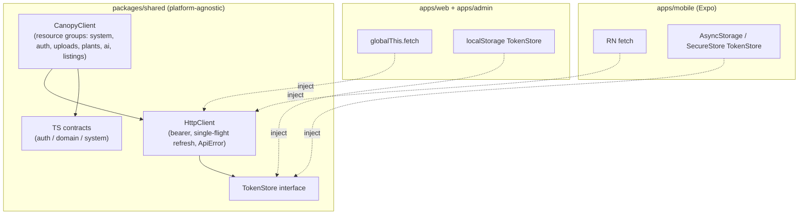
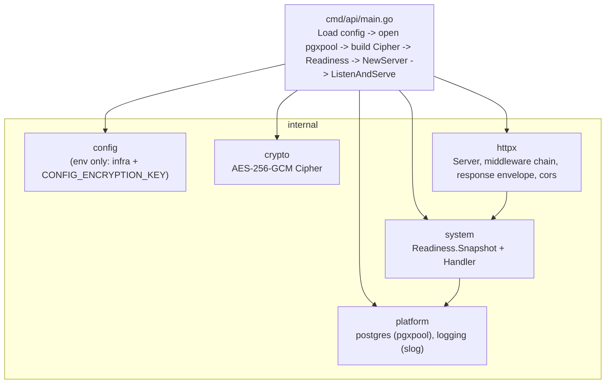
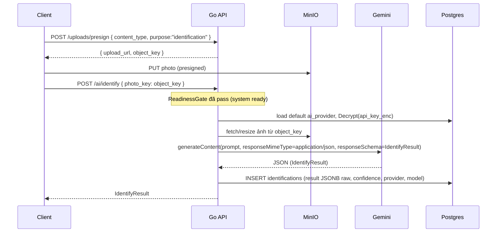
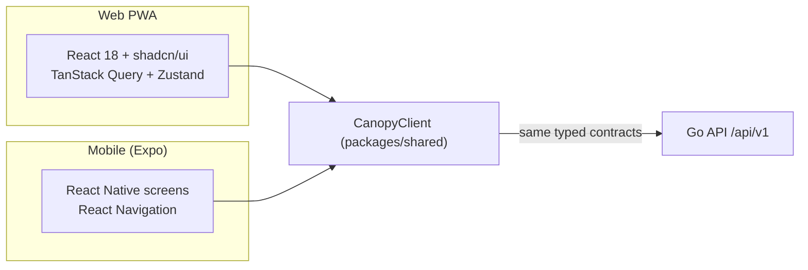
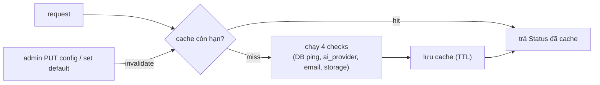

# Canopy — Architecture Deep-Dive

> Tài liệu này tập trung vào **WHY** (lý do thiết kế) và vào **React-Native-readiness**: cách `packages/shared` được thiết kế để cùng một core phục vụ cả web PWA lẫn mobile (Expo). Thuật ngữ kỹ thuật giữ nguyên tiếng Anh.

## Table of Contents

1. [Monorepo Layout](#1-monorepo-layout)
2. [Shared-Core Strategy](#2-shared-core-strategy)
3. [Layered Go Backend](#3-layered-go-backend)
4. [Representative Request Data Flow](#4-representative-request-data-flow)
5. [One API, Two Clients](#5-one-api-two-clients)
6. [Readiness / Config Caching](#6-readiness--config-caching)
7. [Secrets-at-Rest Crypto Envelope](#7-secrets-at-rest-crypto-envelope)
8. [JWT Access + Refresh Rotation](#8-jwt-access--refresh-rotation)
9. [Shared vs Platform-Specific](#9-shared-vs-platform-specific)
10. [Porting to React Native — Checklist](#10-porting-to-react-native--checklist)

---

## 1. Monorepo Layout

```
Canopy/
├── apps/
│   ├── api/                      # Go 1.25 backend (Gin)
│   │   ├── cmd/api/main.go       # entrypoint: load config -> wire deps -> serve
│   │   ├── internal/
│   │   │   ├── config/           # env loading (config.go) — chỉ infra/bootstrap
│   │   │   ├── crypto/           # AES-256-GCM (aesgcm.go) secrets-at-rest
│   │   │   ├── httpx/            # server, middleware, response envelope, cors
│   │   │   ├── system/           # readiness service + handler (activation gate)
│   │   │   └── platform/
│   │   │       ├── postgres/     # pgxpool bootstrap
│   │   │       └── logging/      # slog logger
│   │   └── migrations/           # golang-migrate (000001_init.up.sql = 23 tables)
│   ├── web/                      # React 18 + Vite PWA (player app)
│   ├── admin/                    # React admin portal (config / readiness gate)
│   └── mobile/                   # React Native (Expo) — reuses packages/shared
├── packages/
│   └── shared/                   # TS contracts + CanopyClient/HttpClient (web+mobile)
│       └── src/
│           ├── api/  { client.ts, http.ts, types.ts, index.ts }
│           └── types/{ auth.ts, domain.ts, system.ts, index.ts }
├── docker-compose.yml            # postgres + minio + createbuckets + api
├── .env.example                  # infra env (NO Gemini/Resend keys)
├── pnpm-workspace.yaml
└── docs/                         # SPEC.md, ARCHITECTURE.md, ROADMAP.md
```

**Why monorepo + pnpm workspaces:** một nguồn duy nhất cho TS contracts. Khi schema/đáp ứng API đổi, type cập nhật một chỗ và lan ra web + admin + mobile cùng lúc — không drift contract giữa các app.

---

## 2. Shared-Core Strategy

Nguyên tắc: `packages/shared` **không có platform global** nào ngoài hai thứ inject được — `fetch` và `TokenStore`. Nhờ vậy cùng một module chạy được trong browser, React Native, và Node (SSR/test).



### 2.1 `HttpClient` — single-flight refresh

(`packages/shared/src/api/http.ts`)

- Mọi request kèm `Authorization: Bearer <access_token>` lấy từ `TokenStore.get()` (trừ request `anonymous`).
- Khi gặp `401` (không phải anonymous/noRefresh), client gọi `tryRefresh()`.
- **Single-flight:** một biến `refreshing: Promise<AuthTokens|null>` đảm bảo nếu nhiều request 401 đồng thời, chỉ **một** lần `/auth/refresh` được gửi; các request khác `await` cùng promise đó → tránh refresh stampede.
- Refresh thành công → lưu tokens mới, retry request gốc đúng một lần. Thất bại → `tokens.set(null)` + gọi `onAuthError()` (client điều hướng về login).

### 2.2 `ApiError` normalization

(`packages/shared/src/api/types.ts`)

- Mọi non-2xx và lỗi mạng được chuẩn hóa thành `ApiError { code, message, status, details }`.
- Server envelope `{ error: { code, message, details } }` được map trực tiếp.
- Lỗi mạng → `ApiError('NETWORK_ERROR', ..., 0)`.
- Helper: `isSystemNotReady` (`code === 'SYSTEM_NOT_READY' || status === 503`), `isUnauthorized` (`status === 401`). UI dựa vào đây mà không cần đọc HTTP status thô.

### 2.3 `CanopyClient` resource groups

(`packages/shared/src/api/client.ts`) — entrypoint typed duy nhất, nhóm theo tài nguyên: `system`, `auth`, `uploads`, `plants`, `ai`, `listings`. `persistAuth()` tự lưu tokens sau register/login. `logout()` thu hồi refresh token rồi xóa store.

**Why injectable, không import trực tiếp:** nếu shared import `localStorage` hay `window`, nó vỡ ngay trên React Native. Bằng cách nhận `fetchImpl` và `tokenStore` qua `ClientConfig`, shared core hoàn toàn trung lập nền tảng — đây chính là cốt lõi của RN-readiness.

---

## 3. Layered Go Backend



### 3.1 Middleware chain (order matters)

(`apps/api/internal/httpx/server.go`, `middleware.go`)

```
RequestID -> RequestLogger -> Recovery -> CORS  (global)
                                           └─> ReadinessGate  (on /api/v1 group)
```

| Middleware | Why ở vị trí này |
|------------|-------------------|
| `RequestID` | Đầu tiên — mọi log/handler sau đều có request id để correlate (`X-Request-ID`). |
| `RequestLogger` | Sau id để log kèm id; một dòng structured/request. Không log secret. |
| `Recovery` | Bọc handler — panic → `500 INTERNAL_ERROR` chuẩn, có request id, không crash process. |
| `CORS` | Trước routing — reject origin ngoài allowlist sớm. |
| `ReadinessGate` | Trên group `/api/v1` — chặn route nghiệp vụ khi chưa cấu hình; allowlist `/system`, `/admin/setup`, `/auth/login`. |

### 3.2 system / readiness service

`Readiness.Snapshot(ctx)` (`internal/system/readiness.go`) tổng hợp 4 check (`database`, `ai_provider`, `email`, `storage`) thành `Status { ready, version, missing[], checks{}, checked_at }`. `database` ping pgxpool thực; các check tích hợp khác là placeholder ở Phase 0 và được Phase 1 nối với `system_configs`/`ai_providers` đã giải mã.

**Why tách readiness khỏi health:** `/system/health` = liveness (process còn sống); `/system/status` = readiness (đã cấu hình đủ chưa). Hai khái niệm khác nhau phục vụ probe khác nhau (orchestrator vs frontend gate).

---

## 4. Representative Request Data Flow

Ví dụ: **upload ảnh → presign → AI identify**.



Điểm cốt lõi: API key được **giải mã tại runtime** ngay trước khi gọi Gemini, không bao giờ ở dạng plaintext lâu dài; raw response luôn được lưu.

---

## 5. One API, Two Clients



Cả hai client gọi **cùng một** REST surface với **cùng** TS types. Sự khác biệt chỉ nằm ở UI và ba thứ inject: `fetch`, `TokenStore`, và các native capability (camera, push, file). Backend không cần biết client là web hay mobile.

---

## 6. Readiness / Config Caching

- **Phase 0:** `Snapshot` gọi mỗi request — đơn giản, đúng đắn (database ping rẻ).
- **Phase 1+:** thêm in-memory cache TTL ngắn cho `Status` để tránh ping DB/MinIO và giải mã config mỗi request.
- **Invalidation:** khi admin thay đổi `system_configs`/`ai_providers` (PUT config, set default provider), cache bị invalidate ngay → gate phản ánh tức thì việc app vừa "ready".



---

## 7. Secrets-at-Rest Crypto Envelope

(`apps/api/internal/crypto/aesgcm.go`)

- Thuật toán: **AES-256-GCM** (AEAD), key 32 bytes từ `CONFIG_ENCRYPTION_KEY` (base64).
- **Envelope layout:** `nonce(12) || ciphertext || tag`. `Seal` append ciphertext+tag vào nonce → một blob `BYTEA` duy nhất lưu vào `system_configs.value_enc` / `ai_providers.api_key_enc`.

```
┌──────────────┬───────────────────────┬──────────────┐
│  nonce (12B) │      ciphertext        │   GCM tag    │
└──────────────┴───────────────────────┴──────────────┘
         ▲ random per encrypt (io.ReadFull rand.Reader)
```

- `Decrypt` tách 12 byte đầu làm nonce, phần còn lại `Open`. GCM tag đảm bảo **tính toàn vẹn** (tamper → lỗi giải mã).
- **Why ở DB chứ không phải env:** cấu hình do admin nhập runtime qua portal; không cần redeploy để đổi key; nhiều provider/khóa cùng lúc; chỉ một master key (`CONFIG_ENCRYPTION_KEY`) phải bảo vệ ở hạ tầng.

---

## 8. JWT Access + Refresh Rotation

```mermaid
sequenceDiagram
  participant C as Client (HttpClient)
  participant API as Go API
  participant DB as Postgres
  C->>API: POST /auth/login
  API->>DB: bcrypt verify; INSERT refresh_tokens (token_hash, expires_at)
  API-->>C: { access_token (15m), refresh_token (720h) }
  Note over C: lưu vào TokenStore
  C->>API: request nghiệp vụ + Bearer access
  API-->>C: 401 (access hết hạn)
  C->>API: POST /auth/refresh { refresh_token }  (single-flight)
  API->>DB: match token_hash; rotate: revoke cũ, INSERT mới
  API-->>C: { access_token, refresh_token } mới
  C->>API: retry request gốc
```

- **Access** TTL ngắn (`15m`) → giảm cửa sổ rủi ro nếu rò rỉ.
- **Refresh** TTL dài (`720h`), lưu **hash** trong `refresh_tokens`, **rotation**: mỗi lần refresh thu hồi token cũ (`revoked_at`) và cấp mới → phát hiện reuse.
- Client xử lý refresh **single-flight** (mục 2.1) để không gửi nhiều refresh song song.

---

## 9. Shared vs Platform-Specific

| Concern | Shared (`packages/shared`) | Web (apps/web, admin) | React Native (apps/mobile) |
|---------|----------------------------|------------------------|-----------------------------|
| TS contracts (auth/domain/system) | ✅ | dùng lại | dùng lại |
| `CanopyClient` / `HttpClient` | ✅ | dùng lại | dùng lại |
| `TokenStore` interface | ✅ (interface) | impl `localStorage` | impl `AsyncStorage`/`SecureStore` |
| `fetch` | inject qua `ClientConfig` | `globalThis.fetch` | RN `fetch` |
| `roleHelpers` / `AI_DISCLAIMER` | ✅ | dùng lại | dùng lại |
| UI components | ❌ | shadcn/ui + Tailwind | RN components |
| Routing | ❌ | React Router | React Navigation |
| Data fetching/cache | có thể chia sẻ TanStack Query keys | TanStack Query | TanStack Query |
| Camera / image picker | ❌ | `<input type=file>` / getUserMedia | `expo-camera` / `expo-image-picker` |
| Upload | ❌ (chỉ presign call ở shared) | `fetch PUT` (browser) | `fetch PUT` / `expo-file-system` |
| Notifications | ❌ | Web Push / Service Worker | `expo-notifications` |
| Design tokens | có thể chia sẻ token values | Tailwind theme | RN theme object |
| Offline shell | ❌ | `vite-plugin-pwa` | n/a (native shell) |

---

## 10. Porting to React Native — Checklist

Shared core đã sẵn sàng. Chuyển sang Expo chủ yếu là **swap các adapter nền tảng**, không viết lại logic API.

- [ ] **Reuse `packages/shared`** — thêm vào `apps/mobile` qua workspace; import `CanopyClient`, types, `roleHelpers`, `AI_DISCLAIMER`.
- [ ] **Swap `TokenStore`** — implement interface bằng `expo-secure-store` (token nhạy cảm) hoặc `@react-native-async-storage/async-storage`; inject qua `ClientConfig.tokenStore`.
- [ ] **Provide `fetch`** — RN có `fetch` global; nếu cần, set `ClientConfig.fetchImpl`.
- [ ] **Wire `onAuthError`** — điều hướng về màn Login khi refresh thất bại.
- [ ] **Camera / upload** — `expo-image-picker`/`expo-camera` để lấy ảnh → `uploads.presign()` → `PUT` lên MinIO → truyền `object_key`/`photo_key` vào `ai.identify`/`ai.diagnose`.
- [ ] **Notifications** — `expo-notifications` để lấy device push token → `POST /push-tokens { platform, token }`; nhận `care_reminder` từ worker.
- [ ] **Navigation** — map các route web sang **React Navigation** (stack/tab); dùng `roleHelpers` để gate màn admin/seller/caretaker giống web.
- [ ] **Design tokens → RN theme** — chuyển giá trị token (màu, spacing, radius) từ Tailwind theme sang một **RN theme object** dùng chung trong StyleSheet/styled.
- [ ] **System readiness gate** — gọi `system.status()` khi boot; hiển thị màn "đang cấu hình" nếu `!ready`, giống web.
- [ ] **Verify same API** — chạy app Expo nói chuyện cùng `/api/v1`, xác nhận login/refresh/identify hoạt động không cần đổi backend.

---

*End of ARCHITECTURE.md*
