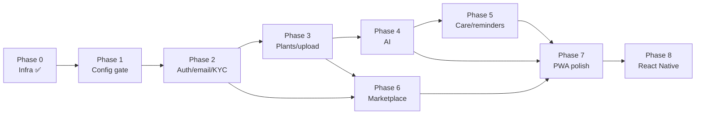

# Canopy — Phased Build Plan & Roadmap

> Kế hoạch xây dựng theo phase, mỗi phase có **goal**, **deliverables** (artifact/file/endpoint cụ thể), **Definition of Done** (checklist test được) và **dependencies**. Thuật ngữ kỹ thuật giữ nguyên tiếng Anh.

## Phase Overview

| Phase | Tên | Trạng thái |
|-------|-----|-----------|
| 0 | Infrastructure & skeleton | ✅ **DONE** |
| 1 | Config & readiness gate | Planned |
| 2 | Auth + email + KYC | Planned |
| 3 | Plants + upload | Planned |
| 4 | AI orchestration | Planned |
| 5 | Care + reminders | Planned |
| 6 | Marketplace | Planned |
| 7 | PWA polish | Planned |
| 8 | React Native (Expo) | Planned |

---

## Phase 0 — Infrastructure & Skeleton ✅ DONE

**Goal:** Bộ khung monorepo chạy được, hạ tầng local sẵn sàng, `/system/status` sống, shared core và web PWA shell có mặt.

**Deliverables**
- Monorepo skeleton: `apps/{api,web,admin,mobile}`, `packages/shared`, `pnpm-workspace.yaml`.
- `docker-compose.yml`: `postgres:16-alpine` + `minio` + `createbuckets` (one-shot) + `api`.
- `.env.example` (infra only; **không** có Gemini/Resend key) + `Makefile`.
- golang-migrate setup với init schema `apps/api/migrations/000001_init.up.sql` (**23 tables**, enums, triggers).
- Go backend layout: `cmd/api/main.go`, `internal/{config,crypto,httpx,system,platform}`.
- `crypto/aesgcm.go` (AES-256-GCM) + test `aesgcm_test.go`.
- `httpx`: middleware chain `RequestID -> RequestLogger -> Recovery -> CORS`, `ReadinessGate`, error envelope `{error:{code,message}}`.
- `system`: `Readiness.Snapshot` + handler → `GET /system/status`, `GET /system/health` live.
- Shared core: `CanopyClient`, `HttpClient` (single-flight refresh, `ApiError`), `TokenStore`, TS contracts (`auth/domain/system`).
- Web PWA shell (Vite + `vite-plugin-pwa`).

**Definition of Done**
- [x] `docker compose up` khởi động postgres + minio + createbuckets thành công.
- [x] `make migrate` áp dụng `000001_init.up.sql`, tạo đủ 23 tables.
- [x] `GET /api/v1/system/health` trả `{status:"ok", version}`.
- [x] `GET /api/v1/system/status` trả `SystemStatus` với `database.ok=true`, các check khác `ok=false`.
- [x] `ReadinessGate` chặn route nghiệp vụ (503 `SYSTEM_NOT_READY`), allowlist `/system`, `/admin/setup`, `/auth/login`.
- [x] `crypto` round-trip Encrypt/Decrypt pass test.
- [x] `packages/shared` build, `CanopyClient.system.status()` gọi được.
- [x] Web PWA shell render + service worker đăng ký.

**Dependencies:** none.

---

## Phase 1 — Config & Readiness Gate ✅ DONE

**Goal:** Admin nhập secrets (Gemini/Resend) lưu mã hóa AES-256-GCM; readiness check thật; gate mở khi cấu hình đủ.

**Deliverables**
- `sysconfig.Service`: cache + TTL + invalidate, decrypt khi đọc, encrypt khi ghi (`internal/sysconfig`).
- Admin endpoints: `GET/PUT /admin/config`, `POST /admin/config/test`, `GET/POST/PUT /admin/ai-providers`, `POST /admin/ai-providers/{id}/default`.
- Readiness checks thật: `ai_provider` (default enabled + key), `email` (`resend_api_key`), `storage` (MinIO `BucketReachable`).
- Auth core (nền cho Phase 2): bcrypt, JWT access+refresh + rotation, `auth.Middleware` (Required/AdminRequired), bootstrap system admin từ env.
- Test-connection thật: Gemini (list models), Resend (domains), MinIO (bucket).
- Frontend: Admin login + **Setup Wizard** (form key + Test + Save + checklist), màn "đang thiết lập" cho user thường.
- **Production deployment**: `docker-compose.prod.yml` + edge Caddy (auto-HTTPS) map 3 domain canopy/admin-canopy/api-canopy.9bricks.com, web Docker (build + serve).

**Definition of Done** *(verified end-to-end against live Postgres + MinIO)*
- [x] Admin nhập Gemini key → `ai_providers` có default enabled; `checks.ai_provider.ok=true`.
- [x] Admin nhập Resend key → `checks.email.ok=true`.
- [x] MinIO verify → `checks.storage.ok=true`.
- [x] Khi cả 4 check ok → `status.ready=true`.
- [x] Secret lưu trong DB là `BYTEA` mã hóa (`leaks_plaintext=false`), `GET /admin/config` trả masked.
- [x] Đổi config invalidate cache → status đổi tức thì.
- [x] RBAC: `/admin/*` không token → 401; non-admin → 403. Refresh token rotation hoạt động.

**Dependencies:** Phase 0.

---

## Phase 2 — Auth + Email + KYC

**Goal:** Đăng ký/đăng nhập, verify email qua Resend, luồng KYC duyệt để bật seller/caretaker.

**Deliverables**
- Auth endpoints: `register`, `login`, `refresh`, `logout`, `me`, `verify-email`, `forgot-password`.
- bcrypt hashing; JWT access+refresh; `refresh_tokens` rotation (hash + `revoked_at`).
- `email_tokens` (verify/reset) + tích hợp Resend gửi email.
- KYC: `POST /kyc/submit`, `GET /kyc/me`, admin `GET /admin/kyc`, `approve`, `reject`.
- Frontend: màn register/login/verify, KYC submit form, admin KYC review.

**Definition of Done**
- [ ] `register` tạo user `is_player=true`, status `pending`, gửi email verify.
- [ ] `verify-email` set `email_verified_at`; token là one-time (`used_at`).
- [ ] `login` trả access(15m)+refresh(720h); `refresh` rotate token; `logout` revoke.
- [ ] Access 401 → client single-flight refresh → retry thành công.
- [ ] KYC submit → `kyc_status=submitted`; admin approve → `verified`; reject → `rejected` + reason.
- [ ] `roleHelpers.canSell/canOfferCare` đúng khi `verified`.

**Dependencies:** Phase 1 (email check phải ready).

---

## Phase 3 — Plants + Upload

**Goal:** Quản lý bộ sưu tập cây + upload ảnh qua presigned MinIO.

**Deliverables**
- `POST /uploads/presign` → `{ upload_url, object_key }`; private bucket cho KYC, bucket thường cho plant/identification.
- Plants CRUD: `GET/POST /plants`, `GET/PUT/DELETE /plants/{id}` (soft-delete).
- `plant_photos` theo dòng thời gian (`kind`).
- Frontend: collection grid, plant detail, upload component.

**Definition of Done**
- [ ] `presign` trả URL hợp lệ; client `PUT` file trực tiếp lên MinIO thành công.
- [ ] Tạo/sửa/xóa cây hoạt động; `DELETE` là soft-delete (`deleted_at`), không hiện trong list.
- [ ] KYC objects nằm bucket private, không truy cập ẩn danh.
- [ ] Ảnh gắn `object_key` vào `user_plants.cover_url`/`plant_photos`.

**Dependencies:** Phase 2 (auth), Phase 1 (storage ready).

---

## Phase 4 — AI Orchestration

**Goal:** 4 năng lực AI qua provider-agnostic interface (Gemini default), structured JSON output, luôn lưu raw.

**Deliverables**
- `AIProvider` interface + Gemini adapter (giải mã key runtime).
- `POST /ai/identify` → `IdentifyResult` (lưu `identifications`).
- `POST /ai/diagnose` → `DiagnoseResult` (lưu `diagnoses`).
- `POST /ai/treatment-plan` → `TreatmentPlan` (lưu `treatment_plans` + `treatment_steps`).
- Care profile generation → `CareProfile` (lưu `plant_species.care_profile`).
- `responseMimeType: application/json` + `responseSchema`; timeout/retry/resize/rate-limit; prompt templates tiếng Việt; hiển thị `AI_DISCLAIMER`.

**Definition of Done**
- [ ] `identify` trả `IdentifyResult` đúng schema; raw lưu vào `identifications.result`.
- [ ] `diagnose` (ảnh + `symptoms_text`) trả `DiagnoseResult`; lưu `diagnoses.result`.
- [ ] `treatment-plan` trả `TreatmentPlan` với `steps[]` theo `day_offset`; lưu plan + steps.
- [ ] Rate-limit AI (`RATE_LIMIT_AI_PER_MIN`) → trả `RATE_LIMITED` khi vượt.
- [ ] Provider đọc từ `ai_providers` (default), key giải mã đúng.
- [ ] Disclaimer hiển thị cạnh mọi kết quả AI.

**Dependencies:** Phase 3 (upload), Phase 1 (ai_provider ready).

---

## Phase 5 — Care + Reminders

**Goal:** Lịch chăm sóc, nhật ký, thông báo in-app + push qua background worker.

**Deliverables**
- Care schedules CRUD + `POST /care/schedules/{id}/done` (ghi `care_logs`, tính `next_due_at`).
- `notifications` + `GET /notifications`, `POST /notifications/{id}/read`.
- `push_tokens` đăng ký + `POST /push-tokens`.
- Background worker (ticker) chuyển `care_schedules` due → `notifications` + push.

**Definition of Done**
- [ ] Tạo schedule với `frequency_days`, `next_due_at`; `done` ghi log + dời `next_due_at`.
- [ ] Worker phát hiện schedule due → tạo `notification` (idempotent) + gửi push.
- [ ] `GET /notifications` list; `read` set `read_at`.
- [ ] Push token đăng ký theo `platform`; unique `(user_id, token)`.

**Dependencies:** Phase 3 (plants).

---

## Phase 6 — Marketplace

**Goal:** Chợ kết nối player/seller/caretaker: listing, chat, review.

**Deliverables**
- Listings: `GET /listings` (lọc kind/species/location), `POST /listings`, `GET /listings/{id}`.
- Conversations + messages: `POST/GET /conversations`, `GET/POST /conversations/{id}/messages`.
- Reviews: `POST /reviews` (rating 1..5).
- Frontend: marketplace browse, listing detail, chat, review.

**Definition of Done**
- [ ] Seller/caretaker (KYC `verified`) tạo được listing; player thường không.
- [ ] Browse + filter listings hoạt động.
- [ ] Mở conversation, gửi/nhận message, `read_at` cập nhật.
- [ ] Review rating 1..5 (CHECK constraint) gắn `target_user_id`/`listing_id`.

**Dependencies:** Phase 2 (KYC), Phase 3 (species/plants).

---

## Phase 7 — PWA Polish

**Goal:** Web PWA installable, offline shell, UX hoàn thiện.

**Deliverables**
- `vite-plugin-pwa` manifest + service worker (precache app shell).
- Offline shell + cache strategy cho asset; TanStack Query cache.
- Install prompt, splash/icon, readiness gate UX.
- Web Push wiring cho `care_reminder`.

**Definition of Done**
- [ ] App **installable** (manifest hợp lệ, install prompt xuất hiện).
- [ ] **Offline shell** render khi mất mạng (precached).
- [ ] Web Push nhận care reminder.
- [ ] Readiness gate UX: user thường thấy màn "đang cấu hình", admin thấy wizard.

**Dependencies:** Phase 1..6.

---

## Phase 8 — React Native (Expo)

**Goal:** App mobile tái sử dụng `packages/shared`, có camera + push, cùng API.

**Deliverables**
- `apps/mobile` (Expo) dùng `CanopyClient` từ `packages/shared`.
- `TokenStore` impl bằng `expo-secure-store`/`AsyncStorage`.
- Camera/upload (`expo-camera`/`expo-image-picker` → presign → MinIO).
- Push (`expo-notifications` → `POST /push-tokens`).
- Navigation map sang React Navigation; design tokens → RN theme.

**Definition of Done**
- [ ] Expo app login/refresh/identify qua **cùng** `/api/v1`, không đổi backend.
- [ ] Chụp ảnh → identify/diagnose hoạt động.
- [ ] Nhận push care reminder trên thiết bị.
- [ ] Readiness gate hoạt động trên mobile (màn "đang cấu hình" khi `!ready`).

**Dependencies:** Phase 1..7.

---

## Master Acceptance Checklist (original spec)

Tiêu chí nghiệm thu tổng cho toàn sản phẩm:

- [ ] **System status gate:** app từ chối nghiệp vụ (503 `SYSTEM_NOT_READY`) cho tới khi admin cấu hình xong; `/system/status` phản ánh đúng.
- [ ] **Register → verify email:** đăng ký tạo user `pending`, email verify (Resend) set `email_verified_at`.
- [ ] **KYC approve:** submit KYC → admin duyệt → `kyc_status=verified` → bật seller/caretaker.
- [ ] **Identify:** chụp/upload ảnh → `IdentifyResult` đúng schema, raw được lưu.
- [ ] **Diagnose + treatment:** ảnh lá + triệu chứng → `DiagnoseResult` → `TreatmentPlan` theo ngày.
- [ ] **Care reminder:** tạo lịch chăm sóc → worker đẩy notification/push đúng hạn.
- [ ] **Marketplace listing + chat + review:** đăng tin, nhắn tin, đánh giá hoạt động end-to-end.
- [ ] **PWA installable + offline shell:** web cài được, app shell chạy offline.
- [ ] **Expo app:** chia sẻ API + camera + push hoạt động trên thiết bị thật.

---

*End of ROADMAP.md*
